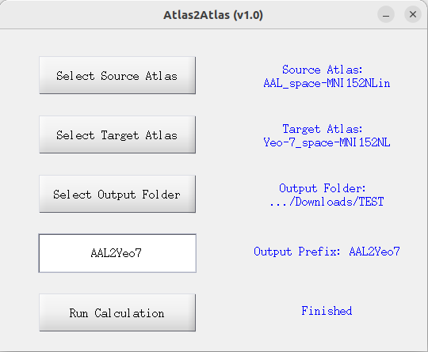

# atlas2atlas

A MATLAB GUI for Atlas-to-Atlas Mapping

## Dependencies

* SPM12 functions are used for reading and writing NIFTI files.

## Usage

1. Add the `code` folder to your MATLAB path.

2. Type `atlas2atlas_gui` in the MATLAB command window to launch the GUI.

3. Select the source atlas file and the target atlas file, specify the output folder and prefix, then click `Run Calculation`.

4. The mapping results will be saved as `*_mapping.txt`. The first column contains the label indices from the source atlas, and the second column contains the corresponding label indices from the target atlas.

## Mapping Metric

* Maximum Overlap: Each region in the source atlas is mapped to the region in the target atlas that shares the largest number of voxels.

## Version History

* v1.1 (2026-01-08): Added the function to save the relabeled source atlas as `*_mapped.nii` for visual check.

